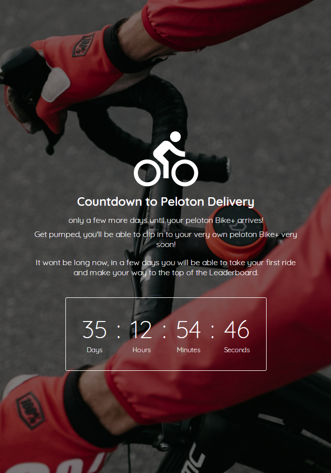

# Peloton Countdown Timer

## Programmer
Chanda Hubbard

## Summary

I created this countdown timer to keep track of how many days are remaining until your Peloton order arrives.

## Technology Used
- React
    - React Hooks
- JavaScript
- CSS
- HTML
- Netlify

## Link to Live App

[Countdown Timer](https://clever-dubinsky-10612d.netlify.app/)

## Landing Page

## Features to implement

- [ ] User authentication/login
- [ ] User input
- [ ] Create state/remember input for each user
- [ ] Add animation to celebrate once counter has reached zero/run out of time

<!-- # Getting Started with Create React App

This project was bootstrapped with [Create React App](https://github.com/facebook/create-react-app).

## Available Scripts

In the project directory, you can run:

### `npm start`

Runs the app in the development mode.\
Open [http://localhost:3000](http://localhost:3000) to view it in the browser. -->

